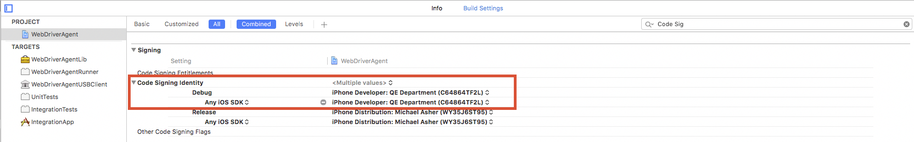
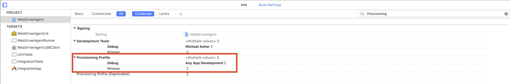
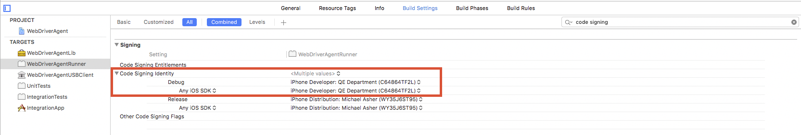
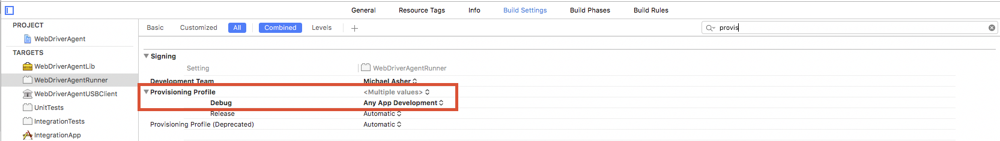
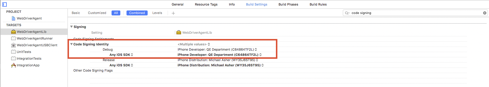

# Appium Research

This repo is intended to show examples on how to use Appium with our Titanium SDK stack.

For the raw notes, you can go here: https://wiki.appcelerator.org/display/qe/Appium+Research. But, this README will formalize those notes.

# Introduction to Appium

This link provides a quick overview of Appium and its core architectural concepts: https://github.com/appium/appium/blob/master/docs/en/about-appium/intro.md.

# Setup

You can follow this installation guide to setup Appium on your machine: https://github.com/appium/appium/blob/master/README.md.

Or, you can follow the below steps, which I used for this repo. The steps will be similar to the ones from the above link, but I will provide some extra notes/caveats:

1. You will need node version >= 4 AND npm version >= 3. If you installed node 4.X from nodejs.org, the node installation comes with npm version 2.X. To install npm version >= 3, use npm e.g: `[sudo] npm install -g npm@3.10.10`.

2. Install Appium: `[sudo] npm install -g appium`.

 **Note:** Appium's installation guide doesn't recommend (which is kind of weird) you to install its module with `sudo`. Because if you do, you will encounter these type of issues: https://github.com/appium/appium/issues/7057. To fix/workaround this issue, simply run chown on the Appium's node_modules directory: `sudo chown -R <user> /usr/local/lib/node_modules/appium/node_modules`.

3. This is an optional step, but you should install `appium-doctor`: `[sudo] npm install -g appium-doctor`. This module will check if your machine is setup properly for Appium and recommend any fixes:

 ```
 $ appium-doctor
 info AppiumDoctor Appium Doctor v.1.2.5
 info AppiumDoctor ### Diagnostic starting ###
 info AppiumDoctor  ✔ Xcode Command Line Tools are installed.
 info AppiumDoctor  ✔ DevToolsSecurity is enabled.
 info AppiumDoctor  ✔ The Authorization DB is set up properly.
 info AppiumDoctor  ✔ The Node.js binary was found at: /usr/local/bin/node
 info AppiumDoctor  ✔ Carthage was found at: /usr/local/bin/carthage
 info AppiumDoctor  ✔ HOME is set to: /Users/wluu
 WARN AppiumDoctor  ✖ ANDROID_HOME is NOT set!
 WARN AppiumDoctor  ✖ JAVA_HOME is NOT set!
 WARN AppiumDoctor  ✖ adb could not be found because ANDROID_HOME is NOT set!
 WARN AppiumDoctor  ✖ android could not be found because ANDROID_HOME is NOT set!
 WARN AppiumDoctor  ✖ emulator could not be found because ANDROID_HOME is NOT set!
 WARN AppiumDoctor  ✖ Bin directory for $JAVA_HOME is not set
 info AppiumDoctor ### Diagnostic completed, 6 fixes needed. ###
 info AppiumDoctor
 info AppiumDoctor ### Manual Fixes Needed ###
 info AppiumDoctor The configuration cannot be automatically fixed, please do the following first:
 WARN AppiumDoctor - Manually configure ANDROID_HOME.
 WARN AppiumDoctor - Manually configure JAVA_HOME.
 WARN AppiumDoctor - Manually configure ANDROID_HOME and run appium-doctor again.
 WARN AppiumDoctor - Add '$JAVA_HOME/bin' to your PATH environment
 info AppiumDoctor ###
 info AppiumDoctor
 info AppiumDoctor Bye, run appium-doctor again when all manual fixes have been applied!
 info AppiumDoctor
 ```

4. In this repo, run `npm install`; this will install dependencies used by the mocha tests.

# Configuring Appium for iOS Devices

At the time of this writing, Appium will not work with iOS devices straight out-of-the-box. You will need to configure Appium some more to work with iOS devices (no configuring needed for Android devices). To configure it for iOS devices, you can follow these steps from appium-xcuitest-driver's README: https://github.com/appium/appium-xcuitest-driver#manual-configuration-alternative.

Or, you can follow the below steps. It's similar to appium-xcuitest-driver's README, but I've added some extra notes:

1. Install `ios-deploy`: `[sudo] npm install -g ios-deploy --unsafe-perm=true`.

  **Note:** The reason why you need the `--unsafe-perm` flag is because you will encounter this issue: http://stackoverflow.com/questions/34195673/ios-deploy-fail-to-install-on-mac-os-x-el-capitan-10-11.

2. Install `deviceconsole`: `[sudo] npm install -g deviceconsole`.

3. Here is the tricky/frustrating part.

4. cd to the directory where you installed `appium`. For example, if you did a global (e.g. `[sudo] npm install -g`) install, go to `/usr/local/lib/node_modules/appium`.

5. From there, cd into `node_modules/appium-xcuitest-driver/WebDriverAgent` and open `WebDriverAgent.xcodeproj` in Xcode.

6. Warnings may appear, about project settings, when you open the Xcode project; allow Xcode to automatically fix the issues.

  **Note:** I didn't record the exact warnings, but Xcode was able to resolve them.

7. Next, select the **Build Settings** for the **WebDriverAgent** project. Make sure of the following:

  a. The **Code Signing Identity** is correctly set for **Debug**:

  

  **Note:** I don't think it's necessary to set the identity for **Release**.

  b. The **Provisioning Profile** is correctly set for **Debug**:

  

8. Next, select the **Build Settings** for the **WebDriverAgentRunner** target. Make sure of the following:

  a. The **Code Signing Identity** is correctly set for **Debug**:

  

  **Note:** I don't think it's necessary to set the identity for **Release**.

  b. The **Provisioning Profile** is correctly set for **Debug**:

  

9. Finally, select the **Build Settings** for the **WebDriverAgentLib** target. Make sure the **Code Signing Identity** is correctly set for **Debug** (no need to set the Provisioning Profile):

  

# Sample Apps and Tests

The next sections will describe how to setup and run the Appium tests for the target test apps.

## KitchenSink

1. For the KitchenSink test app, you will need to generate a new `tiapp.xml` with `appc new` and replace the test app's [tiapp.xml](./KitchenSink/tiapp.xml).

2. To run against iOS:

  a. Only build (don't run) the KitchenSink app for iOS e.g: `appc run -p ios --build-only`.

  b. In `test/ks_ios_test.js` on lines [30-32](./test/ks_ios_test.js#L30-L32), specify the simulator, iOS version, and the `.app` generated from the previous step e.g:
  ```
  ...
  deviceName: 'iPhone 7 Plus',
  platformVersion: '10.2',
  app: '/Users/wluu/github/qe-appium/KitchenSink/build/iphone/build/Products/Debug-iphonesimulator/KitchenSink.app',
  ...
  ```
  c. Start Appium by running `appium`.

  d. Open another terminal window and in this repo, run `npm run test-ios`. This will launch the specified iOS simulator, install the KitchenSink and Webdriver apps to the simulator, and start running the mocha tests.

3. To run only against Android (Genymotion emulator only):

  a. Launch a Genymotion emulator.

  b. Only build (don't run) the KitchenSink app for Android e.g: `appc run -p android --build-only`.

  c. In `test/ks_android_test.js` on lines [30-34](./test/ks_android_test.js#L30-L34), specify the Android version running in the Genymotion emulator, emulator device (from `adb devices`), the `.apk` generated from the previous step, the app package (app id), and the app activity e.g:
  ```
  ...
  platformVersion: '6.0',
  deviceName: '192.168.56.101:5555',
  app: '/Users/wluu/github/qe-appium/KitchenSink/build/android/bin/KitchenSink.apk',
  appPackage: 'com.appcelerator.kitchensink',
  appActivity: '.KitchensinkActivity',
  ...
  ```
  c. Start Appium by running `appium`.

  d. Open another terminal window and in this repo, run `npm run test-android`. This will install the KitchenSink and Webdriver apps to the emulator and start running the mocha tests.

## monkeypush (iOS push on device)

1. For the monkeypush test app, you will need to generate a new `tiapp.xml` with `appc new` and replace the test app's [tiapp.xml](./monkeypush/tiapp.xml).

  **Notes:**
  - Make sure to include the `ti.cloud` module in the `tiapp.xml`.
  - The app assumes that you are properly setup for push notification (i.e. correct certs, registered on 360 dashboard).

2. Only build (don't run) the monkeypush app for iOS device e.g: `appc run -p ios -T device --build-only`.

3. Connect your iOS device to your machine.

4. In `test/ios_push_test.js` on lines [83-86](./test/ios_push_test.js#L83-L86), specify the device name, iOS version, device udid, and the `.ipa` generated from the previous step e.g:
```
...
deviceName: 'Pippin',
platformVersion: '9.3.4',
udid: 'f8052c8714f0b9585a8f89274f447bbd4eda1601',
app: '/Users/wluu/github/qe-appium/monkeypush/build/iphone/build/Products/Debug-iphoneos/monkeypush.ipa'
...
```
5. Start Appium by running `appium`.
6. Open another terminal window and in this repo, run `npm run test-ios-device`. This will install the monkeypush and Webdriver apps to the connected device and start running the mocha tests.

## monkeyjunk (Android push on device)

1. For the monkeyjunk test app, you will need to generate a new `tiapp.xml` with `appc new` and replace the test app's [tiapp.xml](./monkeyjunk/tiapp.xml).

  **Notes:**
  - Make sure to include the `ti.cloud` and `ti.cloudpush` module in the `tiapp.xml`.
  - The app assumes that you are properly setup for push notification (i.e. sender id, server key, registered on 360 dashboard).

2. Only build (don't run) the monkeyjunk app for Android device e.g: `appc run -p android -T device --build-only`.

3. Connect your Android device to your machine.

4. In `test/android_push_test.js` on lines [83-87](./test/android_push_test.js#L83-L87), specify the device name (from `adb devices`), Android version on device, `.apk` generated from the previous step, app package (app id), and app activity e.g:
```
...
platformVersion: '7.1',
deviceName: 'FA6AR0303369',
app: '/Users/wluu/github/qe-appium/monkeyjunk/build/android/bin/monkeyjunk.apk',
appPackage: 'com.appc.junk',
appActivity: '.MonkeyjunkActivity'
...
```
5. Start Appium by running `appium`.
6. Open another terminal window and in this repo, run `npm run test-android-device`. This will install the monkeyjunk and Webdriver apps to the connected device and start running the mocha tests.

# Other Resources

Notes | URL
--- | ---
List of Appium clients | https://github.com/appium/appium/blob/master/docs/en/about-appium/appium-clients.md
Node.js Appium client | https://github.com/admc/wd
Lots of useful Appium documents | https://github.com/appium/appium/tree/master/docs/en
Overview on how to write Appium tests | https://github.com/appium/appium/blob/master/docs/en/writing-running-appium/running-tests.md
Other useful documents when writing Appium tests | https://github.com/appium/appium/tree/master/docs/en/writing-running-appium
Appium examples in Node.js | https://github.com/appium/sample-code/tree/master/sample-code/examples/node
Node.js Appium client APIs  | https://github.com/admc/wd/blob/master/doc/api.md
Promise chaining in Appium (which this repo is using) | https://github.com/admc/wd#element-function-chaining-using-promise-chains
`chai-as-promised` module is used in the by Node.js Appium client | https://www.npmjs.com/package/chai-as-promised
And here is the chai APIs | http://chaijs.com/api/bdd/
APIs that aren't available out-of-the-box for Node.js Appium client | http://appium.io/slate/en/master/#swipe<br>http://appium.io/slate/en/master/#pinch<br>http://appium.io/slate/en/master/#zoom<br>http://appium.io/slate/en/master/#scroll-to
Issues with using XCUITest with Appium | https://github.com/appium/appium/blob/master/docs/en/advanced-concepts/migrating-to-xcuitest.md
Appium GUI; useful for determining what Appium can detect on the UI; recording doesn't really work  | http://appium.io/slate/en/v1.6.0/?javascript#appium-gui
